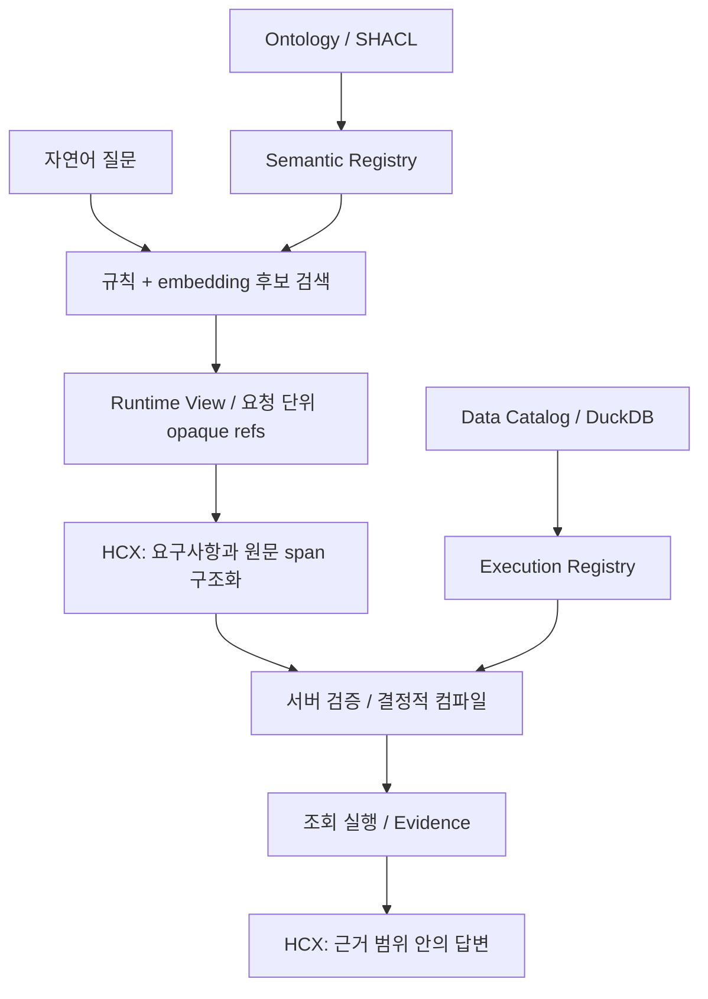

# Canna — 근거 기반 금융상품 Agent

자연어 질문을 **검증 가능한 상품·지표·관계 조회**로 연결하기 위한 연구·개발 프로젝트입니다.
국내채권, 국내 ETF, 해외 ETF, 공모펀드와 외부 holdings를 대상으로 데이터 의미와 조회 단위를 명시하고 답변의 근거를 추적하는 구조를 개발했습니다.

> **개발 중인 프로토타입입니다.** 저장소·Registry·검색·서버 검증 모듈과 실험 코드를 포함합니다.
> 기본 `/answer` API는 응답 계약만 구현되어 있으며, 실제 조회 파이프라인이 연결되지 않아 근거 없음 응답을 반환합니다.
> 완성된 금융상품 추천 서비스나 운영 배포의 성능을 주장하지 않습니다.

## 해결하려는 문제

금융상품 질문은 이름이 비슷한 지표라도 기간·통화·단위가 다르면 다른 조회입니다.
상품 클래스와 포트폴리오를 구분하지 않은 JOIN은 결과 개수를 부풀릴 수 있고,
일부 상품만 수집한 데이터의 순위를 전체 시장 순위로 표현하면 잘못된 답변이 됩니다.

Canna는 이를 **의미 사전, 데이터 binding, 서버 검증, Evidence**로 나누어 다룹니다.

## 핵심 설계

- **의미와 물리 조회 분리:** Ontology/SHACL에서 Semantic Registry를, Data Catalog에서 Execution Registry를 생성하고 일치 여부를 검사합니다.
- **제한된 모델 권한:** HyperCLOVA X가 후보 ref와 질문 원문 span을 제출하도록 설계합니다. 물리 컬럼·SQL·JOIN을 모델의 실행 권한으로 주지 않습니다.
- **서버 검증:** ref, 상품군, 연산과 span을 검증하고 해석이 불명확하면 실행을 막습니다.
- **조회 단위 보존:** 상품·상품 클래스·포트폴리오·종목·관측을 구분하고 직접 보유와 look-through exposure를 분리합니다.
- **주장 범위 제한:** coverage와 freshness가 부족한 결과를 전체 모집단의 순위·개수·부정 명제로 확대하지 않는 것을 원칙으로 둡니다.

아래는 **목표 아키텍처**이며, 전체 흐름의 운영 연결은 미완료입니다.



## 현재 구현 상태

| 영역 | 구현 및 검증 범위 | 남은 범위 |
|---|---|---|
| 데이터 저장소 | 공식 네 상품군·holdings의 DuckDB builder, grain 분리, generation publish | 원본 데이터 별도 확보 필요 |
| Ontology / Registry | Turtle 5개, SHACL, 두 Registry 생성과 mismatch 검사 | 실행용 provenance·population binding 보완 |
| 후보 검색 | 같은 Semantic Registry를 사용하는 규칙·embedding 검색과 평가 도구 | 후보 recall 및 운영 품질 개선 |
| Runtime View | opaque ref, 요구사항 검증, span canonicalization | HCX 생성 안정성, 미지원 요구 구조 |
| 상품 실행 | 격리된 계약에서 filter/order/count/aggregate와 Evidence 경로 검증 | production compiler 및 실제 Registry 연결 |
| HTTP API | `GET /answer` 응답 schema와 오류 경계 테스트 | 실제 조회·HCX 최종 답변 연결 |

실제 Execution Registry에 필요한 binding이 없으면 실행을 `unavailable`로 차단합니다.
합성 계약의 테스트 성공은 실제 데이터 E2E 성공을 의미하지 않습니다.
상세 진행 기록은 [구현 계획](IMPLEMENTATION_PLAN.md)을 참고하세요.

## 원본 데이터와 API 키 없이 확인하기

Python 3.12 이상과 `uv`가 필요합니다. 저장소 루트에서 실행합니다.

```bash
git clone https://github.com/kth630/canna_agent.git
cd canna_agent
uv sync --locked --group dev
uv run python -c "from pathlib import Path; Path('.tmp').mkdir(exist_ok=True)"

# 원본 데이터와 API 키 없이 실행할 수 있는 테스트
uv run pytest tests/test_api.py tests/test_architecture_guards.py tests/test_semantic_registry.py tests/test_ontology_shacl.py tests/runtime_view/test_canonicalize.py tests/execution -q -m "not real_data and not hcx_live and not embedding_live"

# 원본 데이터 없이 의미 Registry 생성
uv run python scripts/build_registries.py --semantic-only

# 응답 계약 확인용 API (실제 상품 조회는 미연결)
uv run uvicorn canna.api:create_app --factory --app-dir src --host 127.0.0.1 --port 8000
```

API 실행 후 `http://127.0.0.1:8000/docs`에서 `/answer`를 확인할 수 있습니다.
`question_id`, `question`을 입력하면 5개 문자열 필드가 반환됩니다.
`retrieved_context`의 현재 상태는 `answer_status=refused`, `pipeline_stage=transport_only`이며 실제 상품·수치는 반환하지 않습니다.

위 테스트는 API 계약, 아키텍처 guard, Ontology/Registry, 서버 canonicalization과 합성 실행 계약을 검증합니다.
모델 정확도나 실데이터 서비스 품질을 측정하지 않습니다. 환경과 결과는 [검증 기록](docs/PORTFOLIO_VALIDATION.md)에 기록합니다.

## 실제 데이터와 모델을 사용하는 경로

원본 Excel·수집 ZIP·생성 DB·인증정보는 Git에 포함하지 않습니다.
실제 데이터 build에는 [출처 manifest](provenance/MIGRATION_MANIFEST.json)에 대응하는 사용 권한이 있는 파일을 별도로 준비해야 합니다.

```text
data/official_raw/   공식 Excel 원본 (읽기 전용)
data/incoming/       외부 holdings 원본 번들 (읽기 전용)
data/processed/      재생성 가능한 조회 저장소와 Registry
```

```bash
uv run python scripts/build_query_store.py
uv run python scripts/build_registries.py
```

HCX와 embedding의 실제 호출에는 자격증명이 필요합니다. 변수 이름은 [.env.example](.env.example)에 있으며 값은 로컬 `.env`에만 보관합니다.
live 테스트는 기본 제외됩니다. 원본 build와 live 실험은 위 데모와 별개입니다.

## 실험에서 배운 점

HCX가 opaque ref를 정확히 복사하는 것과 질문 전체를 올바르게 구조화하는 것은 별개였습니다.
조건값·비교 연산자·정렬 및 관계 방향의 보존 실패, 원문에 없는 span 생성,
후보 순서에 따른 결과 변동을 기록했습니다. 이에 따라 값 정규화와 방향 결정 책임을 서버로 옮겼습니다.

더 엄격한 채점으로 초기 성공률이 낮아진 결과도 보존했습니다.
실패를 기록하고 책임 경계를 수정한 과정은 [수정 실험 보고서](provenance/experiments/stage_0a_semantic_grounding/FINDINGS_REVISED.md)와 [아키텍처](ARCHITECTURE.md)에서 확인할 수 있습니다.
후속 PlanOption 실험은 제안 단계이며 승인된 운영 계약을 대체하지 않습니다.

## 코드와 문서 안내

| 경로 | 내용 |
|---|---|
| [`src/canna/store/`](src/canna/store/) | 원본 입력, 조회 저장소, 파생 데이터 publish |
| [`ontology/`](ontology/), [`catalog/`](catalog/) | 의미 정의와 물리 binding 입력 |
| [`src/canna/registry/`](src/canna/registry/) | Registry 생성·일치 검증 |
| [`src/canna/retrieval/`](src/canna/retrieval/) | 후보 검색과 retrieval 평가 |
| [`src/canna/runtime_view/`](src/canna/runtime_view/) | ref·요구사항·span 검증 |
| [`src/canna/execution/`](src/canna/execution/) | 상품 실행과 Evidence |
| [`src/canna/experiments/`](src/canna/experiments/) | 운영 코드와 분리된 반증 실험 |
| [`tests/`](tests/) | 계약, 구조적 변형, 실패 경계 테스트 |

작업을 이어갈 때는 [CONTEXT](CONTEXT.md) → [질문 구조](QUESTION_STRUCTURE.md) →
[아키텍처](ARCHITECTURE.md) → [구현 계획](IMPLEMENTATION_PLAN.md) →
[데이터·온톨로지 정렬 결정](provenance/workstreams/20260830_preintegration_parallel/DATA_ONTOLOGY_ALIGNMENT_DECISION_20260830.md) →
[관련 계약](contracts/EVALUATION_API.md) 순서로 읽습니다. 작업 규칙은 [AGENTS.md](AGENTS.md)를 따릅니다.

## 다음 단계

- HCX 의미 구조화의 안정성과 책임 축소안을 검토하고 계약을 확정합니다.
- 실제 Registry의 provenance·as-of·population binding과 production compiler를 연결합니다.
- claim별 coverage 정책을 Evidence 및 최종 답변까지 일관되게 적용합니다.
- 실제 데이터 E2E와 배포 환경의 timeout·동시성·복구를 검증합니다.

사용자 주도로 목표·범위·아키텍처를 결정하고, Codex와 Claude를 활용해 설계 검토·구현·실험을 진행했습니다.
이 저장소는 데이터 의미를 보존하는 설계와 검증 과정을 보여주는 포트폴리오입니다.
